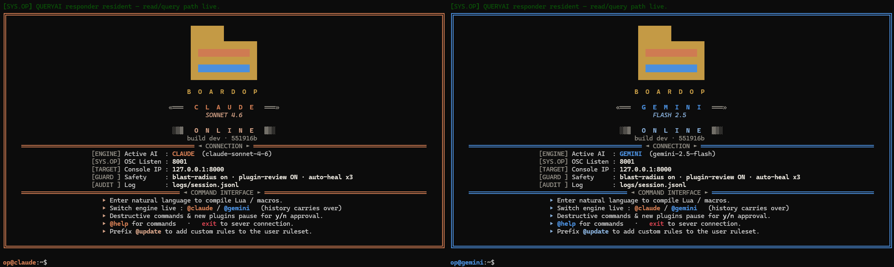
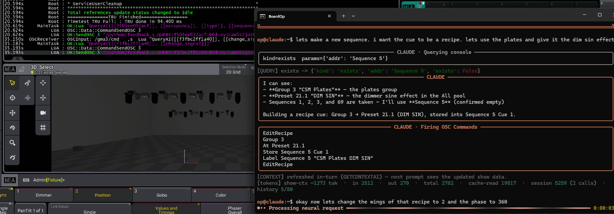

<div align="center">

# BoardOp

###  AI board operator in the terminal — talk to your grandMA3 console in plain English.

*Store data · Write plugins · Analyze your showfile.*




**🌐 [Website](https://boardop.dev)** 

</div>

---

## What it is


BoardOp is a **tireless assistant programmer** for grandMA3. You type plain English —
*"turn group 69 on, make them orange"* — and it turns that into real MA3 commands
or a full Lua plugin and deploys it straight to the console.

```text
op@claude:~$ turn group 69 on, make them orange
#   → builds the cues + sequence and deploys them to the console
op@claude:~$ @gemini now make them blue
op@gemini:~$ @claude actually revert that
#   ↑ switch AI engines mid-session — the conversation carries over
```

It's not just a command generator. Ask it what a sequence does, what's patched in your
show, or how you'd build something before committing — it reads your actual showfile and
answers in plain English. As useful for **understanding** a show (or learning the console)
as it is for changing one.

---

## Why it's different

- 🗣️ **Plain English → real MA3.** Sequences, cues, MAtricks, presets, executors —
  described, not hand-typed in exact syntax.
- 👁️ **It sees your show.** A live snapshot of your showfile — every pool, the rig,
  what's playing, even the programmer — so it works with *your* real names and IDs,
  not guesses.
- 🔁 **Self-healing.** When the console rejects a plugin, the error loops back to the
  AI and it fixes its own code — automatically, within safe bounds.
- 🪟 **Plugins into panels.** `@polish` turns a working plugin into a resident GUI
  panel — on-screen buttons and fields, imported natively into the plugin pool.
- 🧠 **Dual-AI, one memory.** Claude *and* Gemini, swappable mid-session with full
  context handover.
- 🛡️ **You approve everything.** Destructive commands and every generated plugin pause
  for your `y/n` before anything touches the console.
- 📚 **Grounded in console truth.** Built on a verified object model harvested from the
  console itself — 565 classes, 15,000+ properties, 5,000+ enum values — so it doesn't
  invent syntax.
- ⚡ **Zero console-side setup.** The bridge installs its own console plugins into your
  showfile automatically. Open a show, launch BoardOp, go.

---

## How it works

```
You (terminal)
   │  natural language
   ▼
BoardOp ──► AI engine (Claude / Gemini)
   │              │
   │              └─► MA3 commands  or  a generated Lua plugin
   │  OSC (localhost)
   ▼
grandMA3 ──► errors feed back ──► the AI self-corrects
```

Run it next to grandMA3 **onPC** on one machine. To drive a real desk, the onPC joins
your console's session and MA's own session sync carries the changes across —
**hardware-verified on a real grandMA3 console.**

Every action passes through safety gates first: a destructive-keyword filter on
commands, a mandatory human review of every generated plugin, and an all-or-nothing
hold when a response mixes both. These are guardrails, not guarantees — BoardOp is for
**programming and pre-production, not live show operation.**



---

## What you'll need

- Windows PC with **grandMA3 onPC** (v2.x)
- **Python 3.10+**
- Your own API key for **Anthropic** (Claude) and/or **Google** (Gemini) — bring your
  own keys; your conversations go directly to your provider, nowhere else

---

## Status

**BoardOp is in beta.** It's feature-complete and drives a real console, but it's a
power tool, not a polished product: always test on onPC first, keep a hand on the
console, and never point it at a live show you can't afford to interrupt.

⭐ **Star or watch this repo** to catch the release.

---

## License

Licensed under **[FSL-1.1-Apache-2.0](LICENSE)** — free to use, modify, and
redistribute for any purpose (including professional show programming), except
offering it as a competing product. Each release converts to plain Apache 2.0 after
two years. The console-side plugins in `ma3_plugins/` are **MIT-licensed**, so
showfiles that include them can be shared freely.

*"grandMA3" is a trademark of MA Lighting Technology GmbH. BoardOp is an independent,
unofficial project, not affiliated with or endorsed by MA Lighting.*
